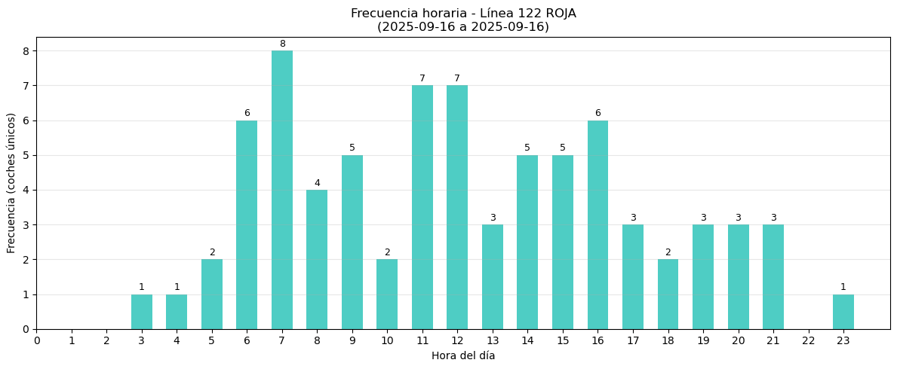
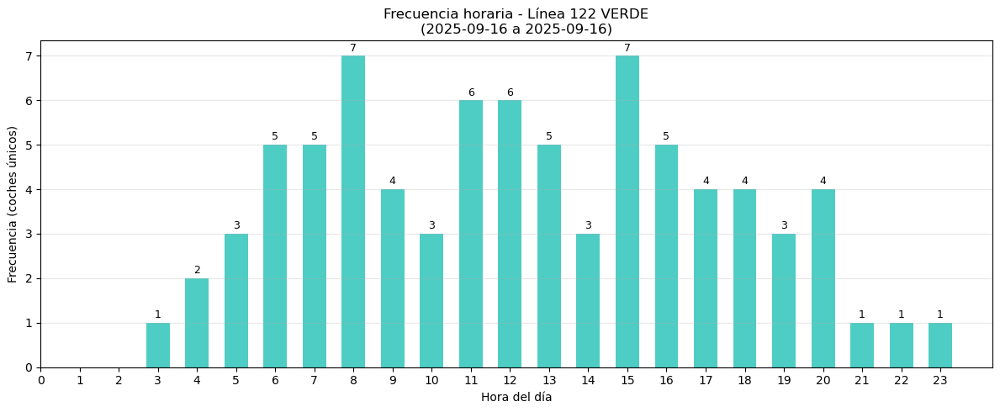
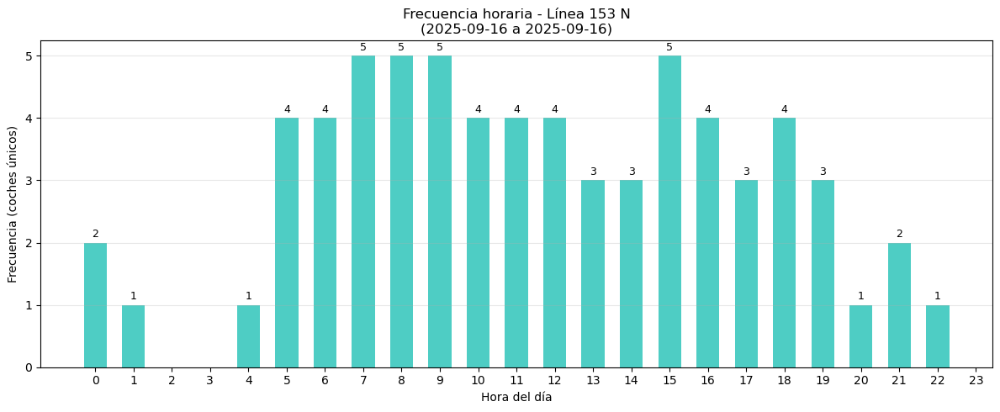
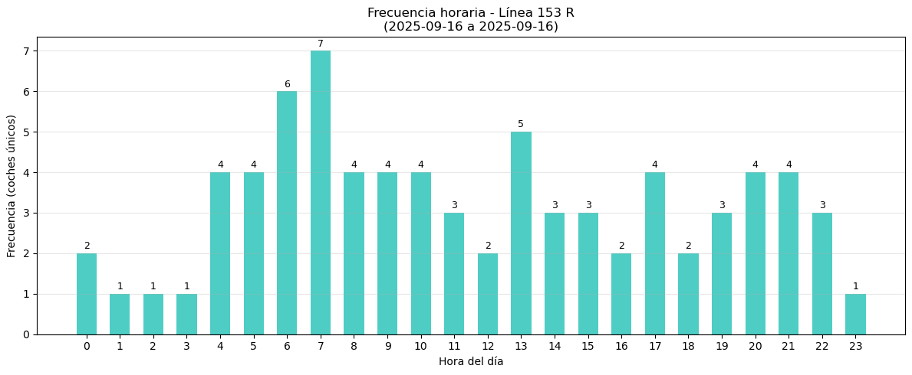

🌐 [Leer en Español](README.md)

# 🚍 Bus Frequency Analysis in Rosario

This repository contains an exploratory analysis of bus frequency data  
in Rosario, Argentina. The data was collected through a script that queries  
the city's public API every 5 minutes, recording each bus's position and estimated arrival time.

---

## Example Results

| Line | Chart |
|------|-------|
| 122 ROJA |  |
| 122 VERDE |  |
| 153 N |  |
| 153 R |  |

> **Note:** Bars represent the number of unique buses detected per hour.  
> If the selected date range covers multiple days, the frequency is calculated as a daily average.

---

## Repository Contents

- `analisis_colectivos_rosario.ipynb` → Notebook in Spanish  
- `analisis_colectivos_rosario_en.ipynb` → Translated notebook in English  
- `/images` → Reference charts for quick visualization  

---

## Tech Stack

- **Python 3.10+**
- **Pandas** (data cleaning & analysis)
- **Matplotlib** (visualization)
- **NumPy** (numerical operations)
- **Jupyter Notebook** (interactive environment)

---

## How to Reproduce the Analysis

1. Clone this repository:
   ```bash
   git clone https://github.com/ernes2111/analisis_colectivos_rosario.git

🌐 [Leer en Español](README.md)
